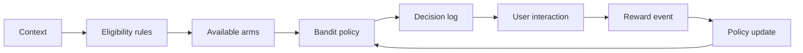

# Bandit Decision Pipeline

Use this when the system chooses between options and learns from feedback.

Examples:

- offer selection;
- banner selection;
- channel selection;
- message variation selection.

## Simplified flow

## Notes

- The decision must be logged.
- Rewards can be delayed.
- Exploration should be controlled.
- Fairness and suitability matter.

See:

- [bandits](../models/bandits.md)
- [bandit metrics](../metrics/bandits.md)
