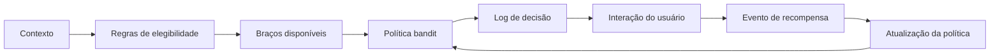

# Pipeline de decisão com bandit

Use quando o sistema escolhe entre opções e aprende com feedback.

Exemplos:

- seleção de oferta;
- seleção de banner;
- seleção de canal;
- seleção de variação de mensagem.

## Fluxo simplificado

## Notas

- A decisão precisa ser registrada.
- Recompensas podem ter atraso.
- Exploração deve ser controlada.
- Fairness e suitability importam.

Veja:

- [bandits](../models/bandits.pt-BR.md)
- [métricas de bandits](../metrics/bandits.pt-BR.md)
