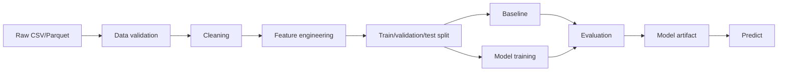

# Basic Tabular Training Architecture

Use this for supervised tabular problems such as classification or regression.

Examples:

- churn prediction;
- conversion prediction;
- price prediction;
- fraud classification.

## Simplified flow

## Notes

- Start with a baseline.
- Keep feature engineering separate.
- Avoid leakage before the split.
- Use the right metric for the task.

See:

- [supervised learning](../models/supervised.md)
- [classification metrics](../metrics/classification.md)
- [regression metrics](../metrics/regression.md)
