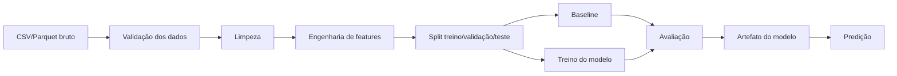

# Arquitetura básica de treino tabular

Use para problemas tabulares supervisionados, como classificação ou regressão.

Exemplos:

- previsão de churn;
- previsão de conversão;
- previsão de preço;
- classificação de fraude.

## Fluxo simplificado

## Notas

- Comece com baseline.
- Separe engenharia de features.
- Evite vazamento antes do split.
- Use a métrica certa para a tarefa.

Veja:

- [modelos supervisionados](../models/supervised.pt-BR.md)
- [métricas de classificação](../metrics/classification.pt-BR.md)
- [métricas de regressão](../metrics/regression.pt-BR.md)
