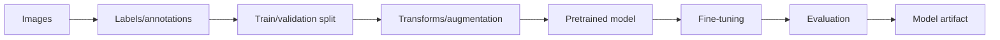

# Image Training Pipeline

Use this when the input is an image.

Examples:

- image classification;
- object detection;
- segmentation;
- light fine-tuning from a pretrained model.

## Simplified flow

## Notes

- Image training usually needs PyTorch or TensorFlow/Keras.
- Fine-tuning is usually better than training from scratch.
- Always inspect predictions visually.

See:

- [vision models](../models/vision.md)
- [vision metrics](../metrics/vision.md)
- [fine-tuning](../workflows/fine-tuning.md)
