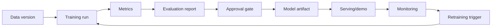

# Basic MLOps Lifecycle

Use this view when the model needs to be trained, evaluated, approved, and reused.

## Simplified flow

## Notes

- Keep track of data, code, parameters, metrics, and artifacts.
- Define what is good enough before promoting a model.
- Have a rollback plan.
- Document limitations.

This starter kit does not enforce a full MLOps stack. It only gives a simple structure to grow from.
