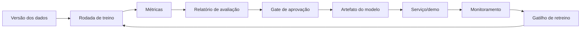

# Ciclo básico de MLOps

Use esta visão quando o modelo precisa ser treinado, avaliado, aprovado e reutilizado.

## Fluxo simplificado

## Notas

- Rastreie dados, código, parâmetros, métricas e artefatos.
- Defina o que é bom o suficiente antes de promover um modelo.
- Tenha plano de rollback.
- Documente limitações.

Este starter kit não força uma stack completa de MLOps. Ele só oferece uma estrutura simples para evoluir.
