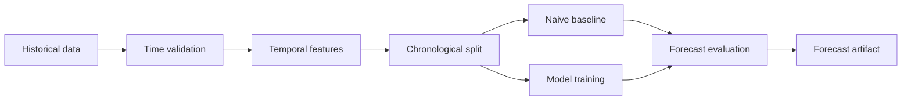

# Time Series Pipeline

Use this when event order matters.

Examples:

- sales forecast;
- demand forecast;
- traffic forecast;
- temporal anomaly detection.

## Simplified flow

## Notes

- Do not use random split by default.
- Lags and rolling means must avoid future leakage.
- Compare against simple baselines before LSTM.

See:

- [time series and LSTM](../models/time-series.md)
- [time series metrics](../metrics/time-series.md)
