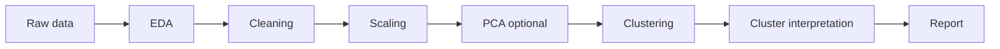

# Unsupervised Learning Pipeline

Use this when there is no target column.

Examples:

- customer segmentation;
- exploratory clustering;
- dimensionality reduction;
- anomaly discovery.

## Simplified flow

## Notes

- Scaling is usually important.
- PCA can help visualization and noise reduction.
- Clusters need interpretation.
- A cluster is not automatically a business segment.

See:

- [unsupervised learning](../models/unsupervised.md)
- [clustering metrics](../metrics/clustering.md)
