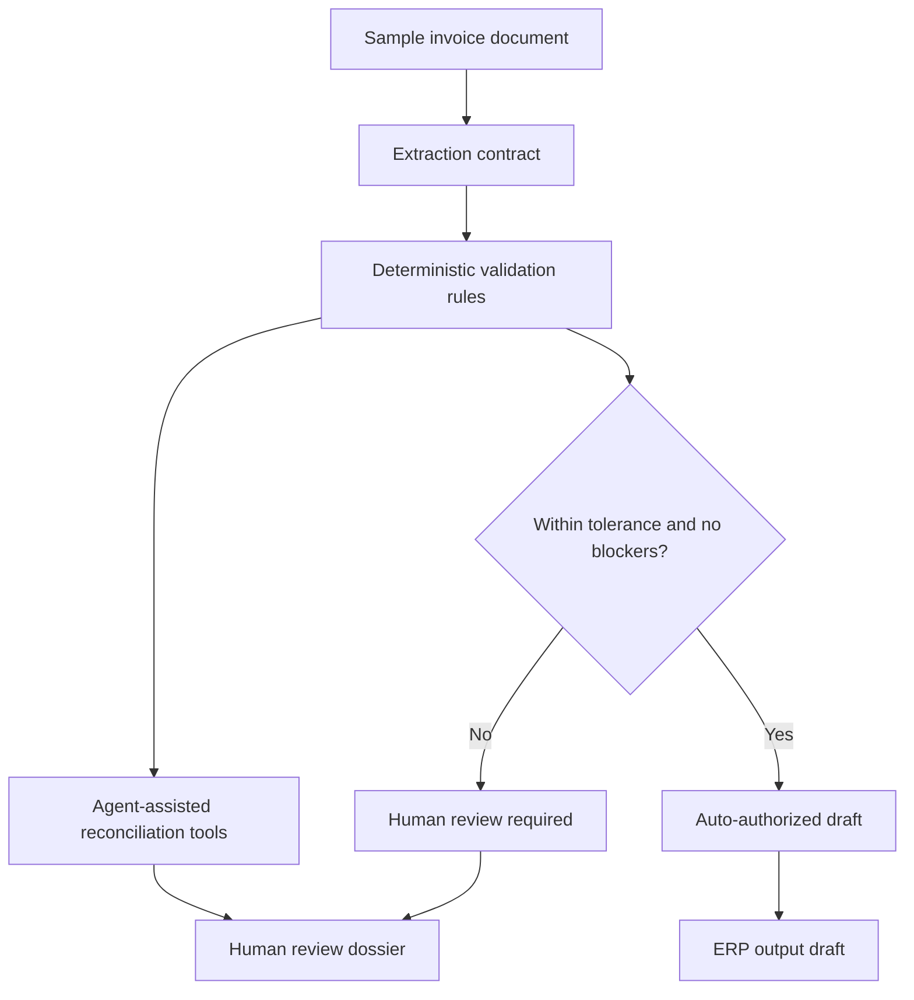
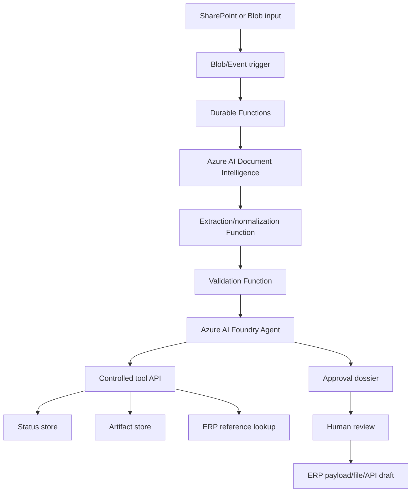

# Azure Document AI Invoice Agent Lab — Implementation Spec

> Status: future implementation spec.
> Scope: generated educational project profile for `ml-starter-lab-kit`.
> This document describes how the starter kit could generate a local-first lab that models an Azure Document Intelligence + agent-assisted invoice reconciliation solution.

---

## 1. Purpose

Add an optional generated project profile that teaches a realistic AI solution pattern:

```text
invoice PDF or sample document
→ extraction contract
→ deterministic validation
→ agent-assisted reconciliation/audit
→ human review dossier
→ ERP-ready output artifact
```

The lab is educational and reference-oriented. It must help a learner understand how Document AI, deterministic rules, agent tools, HITL, and ERP-output contracts fit together without requiring a real Azure subscription for the first local run.

---

## 2. Product positioning

This is not a normal supervised ML training project. It is a **solution lab** inside the starter kit.

It should be presented as:

```text
A local-first Azure AI solution scaffold for invoice processing and agent-assisted reconciliation.
```

The generated project should teach architecture and workflow discipline, not promise production-ready ERP automation.

---

## 3. Non-goals

Do not implement in the first version:

- real Azure deployment;
- real Azure SDK calls by default;
- real ERP integration;
- portal/RPA capture automation;
- credentials, Key Vault, tenant/RBAC, or production identity flows;
- custom model training for Document Intelligence;
- full accounting/fiscal decision automation;
- multi-client/multi-tenant platform behavior;
- hidden agent autonomy that bypasses deterministic rules.

The first version should stay local, deterministic, testable, and explainable.

---

## 4. Recommended first implementation slice

The first coding issue should generate a project scaffold with:

```text
configs/invoice_agent_config.json
contracts/invoice-extraction.schema.json
contracts/validation-result.schema.json
contracts/agent-dossier.schema.json
contracts/erp-output.schema.json
data/samples/invoices/sample_invoice.txt or sample_invoice.json
src/<package>/invoice_pipeline.py
src/<package>/invoice_rules.py
src/<package>/invoice_agent_tools.py
src/<package>/erp_output.py
notebooks/01_invoice_agent_lab.ipynb or docs/invoice-agent-lab.md
reports/ generated at runtime
```

The first implementation may use a text/JSON sample instead of a real PDF. It should make the processing contract clear and leave real OCR/Azure integration for a follow-up.

---

## 5. Local user flow

A generated project should support a simple learner flow.

```bash
python -m <package>.lab invoice-agent demo
python -m <package>.lab invoice-agent run --config configs/invoice_agent_config.json
python -m <package>.lab invoice-agent dossier --invoice-id sample-001
```

Exact command names may follow nearby `lab.py` conventions.

Expected local flow:

1. Load a deterministic sample invoice extraction.
2. Normalize fields and line items.
3. Run deterministic rules.
4. Run agent-tool simulation over the same safe data.
5. Produce a human-readable dossier.
6. Produce an ERP-output draft only when authorization status permits it.
7. Produce a pipeline manifest entry if the generated project already supports manifest artifacts.

---

## 6. Target architecture taught by the lab



The generated project should explain that in a real Azure implementation the extraction step can be backed by Azure AI Document Intelligence and the agent can be backed by Azure AI Foundry Agent Service. The local scaffold should not require those services to run.

---

## 7. Azure target architecture notes

The docs in the generated project should include this target architecture as a learning reference:



Generated docs must label this as a future Azure reference, not as behavior implemented by the local lab.

---

## 8. Data contracts

### 8.1 Invoice extraction

Minimum fields:

```json
{
  "invoice_id": "sample-001",
  "supplier": "sample supplier",
  "invoice_number": "INV-001",
  "issue_date": "2026-01-01",
  "due_date": "2026-01-31",
  "total_amount": 1000.0,
  "currency": "BRL",
  "items": [
    {
      "item_id": "item-001",
      "description": "mobile service",
      "candidate_classification": "mobile_service",
      "quantity": 10,
      "unit_amount": 100.0,
      "total_amount": 1000.0,
      "confidence": 0.95,
      "evidence_ref": "page-1-line-10"
    }
  ]
}
```

### 8.2 Validation result

Minimum fields:

```json
{
  "invoice_id": "sample-001",
  "status": "passed | warning | blocked",
  "tolerance_percent": 2.0,
  "rules": [
    {
      "rule_id": "sum_matches_total",
      "severity": "info | warning | blocker",
      "status": "passed | failed",
      "message": "string"
    }
  ]
}
```

### 8.3 Agent dossier

Minimum fields:

```json
{
  "dossier_id": "dossier-sample-001",
  "invoice_id": "sample-001",
  "summary": "string",
  "recommended_action": "auto_authorize | human_review | correction_required | reject",
  "explanations": [],
  "evidence_refs": [],
  "tool_calls": []
}
```

### 8.4 ERP output draft

Minimum fields:

```json
{
  "erp_output_id": "erp-sample-001",
  "invoice_id": "sample-001",
  "authorization_status": "auto_authorized | human_approved",
  "items": [],
  "created_at": "datetime"
}
```

---

## 9. Deterministic rules

The first version should include only simple, teachable rules:

- item total sum matches invoice total within tolerance;
- reference amount difference is within tolerance when a reference amount is configured;
- required fields exist;
- low-confidence fields become review warnings;
- blocked validations prevent ERP output draft generation;
- financial charges such as interest/fee categories are separated from normal recurring/service categories when present in the sample data.

The rules must be deterministic and tested. The agent may explain rule results, but must not override them.

---

## 10. Agent behavior

The generated lab should model an agent as controlled tools and deterministic, testable local behavior.

First version may implement a rule-based local agent simulation. It should still expose the intended tool boundary:

- `get_invoice_extraction(invoice_id)`;
- `get_validation_results(invoice_id)`;
- `get_invoice_evidence(invoice_id, field_or_item_id)`;
- `explain_divergence(invoice_id)`;
- `build_approval_dossier(invoice_id)`;
- `draft_erp_output(invoice_id)`.

The generated docs should explain how these map to a future Azure AI Foundry tool-calling pattern.

---

## 11. Generated learning material

The generated project should explain:

- why OCR/extraction is separate from validation;
- why deterministic rules own approval logic;
- why the agent is a reconciliation/audit assistant, not an autonomous approver;
- why HITL is required for low-confidence or blocked cases;
- how ERP output differs from raw extraction;
- what changes when this local lab becomes an Azure solution.

---

## 12. Dependency policy

The generator should not require Azure dependencies to create this project.

The generated local lab should prefer existing lightweight dependencies already used by generated projects. If new optional dependencies are required, they must be justified and isolated to this profile.

Real Azure SDK dependencies should be follow-up work behind an optional Azure integration profile.

---

## 13. Testing requirements for implementation issues

Implementation should include tests proving:

- the generator can create the invoice-agent lab profile;
- expected files are generated;
- config and contracts exist;
- local demo command creates report artifacts;
- validation blocks ERP output when a blocker exists;
- dossier generation explains the blocked or auto-authorized state;
- existing generated project flows still work.

Recommended proof:

```bash
pytest -q
```

Focused tests may be used if full suite runtime is too broad.

---

## 14. Implementation waves

### Wave 1 — Local scaffold and deterministic demo

- Add generated profile or option for the invoice-agent lab.
- Generate contracts, config, sample data, local modules and docs.
- Add local deterministic pipeline and dossier artifacts.
- No Azure SDK calls.

### Wave 2 — Optional Azure architecture docs and config placeholders

- Add optional docs for Azure target architecture.
- Add `.env.example` placeholders without secrets.
- Add clear instructions for future Azure integration.

### Wave 3 — Optional Document Intelligence adapter

- Add an optional adapter boundary for Azure AI Document Intelligence.
- Keep local fake adapter as default.
- Add tests for adapter contract without requiring cloud credentials.

### Wave 4 — Optional Foundry agent integration notes

- Add Foundry agent definition scaffold or docs only.
- Preserve controlled tool boundary.
- Do not add autonomous approval.

---

## 15. Stop rules for future coding issues

Do not implement a coding PR if:

- the change requires real Azure credentials for tests;
- the local lab cannot run without cloud services;
- the agent can override deterministic validation;
- ERP output is generated for blocked invoices;
- production security or real ERP behavior is implied but not implemented;
- the implementation rewrites unrelated ML training/baseline/notebook flows;
- the change becomes a generic Azure platform instead of a bounded generated lab profile.
